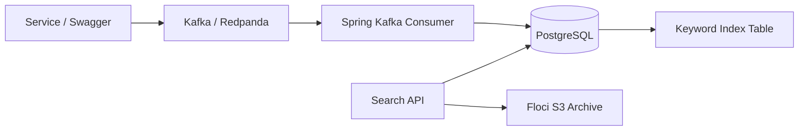

# LogQuery Engine

LogQuery Engine is a Java and Spring Boot backend for ingesting, indexing, searching, and archiving application logs. It uses Kafka for asynchronous log ingestion, PostgreSQL for hot searchable storage, and Floci S3 for cold archival.

## Use Case

Applications produce logs continuously, but teams need fast ways to search recent logs and cheaper storage for older records. LogQuery Engine models that workflow with a hot query path and an object-storage archive path.

## Architecture



## Core Features

- Publish log events to Kafka.
- Persist normalized log records in PostgreSQL.
- Build an inverted keyword index from log messages.
- Search by service, severity, time range, and keyword.
- Return paginated results sorted by event time.
- Archive older logs to S3-style object storage through Floci.
- Keep ingestion idempotent with a unique `eventId`.

## Run Locally

Start dependencies:

```bash
docker compose up -d
```

Run the app:

```bash
mvn spring-boot:run
```

Swagger UI:

```text
http://localhost:8081/swagger-ui.html
```

## APIs

| Method | Path | Purpose |
| --- | --- | --- |
| `POST` | `/api/logs/publish` | Publish log event to Kafka |
| `POST` | `/api/logs/ingest` | Ingest log directly into storage/index |
| `GET` | `/api/logs/search` | Search logs by filters and keyword |
| `POST` | `/api/logs/archive` | Archive older logs to Floci S3 |

## Tests

Run:

```bash
mvn test
```

## Design Tradeoffs

- Kafka is used for asynchronous ingestion, not as the source of truth.
- PostgreSQL stores the hot query model and keyword index for the MVP.
- Floci S3 is used only for cold archival, where object storage matches the access pattern.
- The keyword index is intentionally simple and deterministic; it can later be replaced by a search engine if query volume grows.
